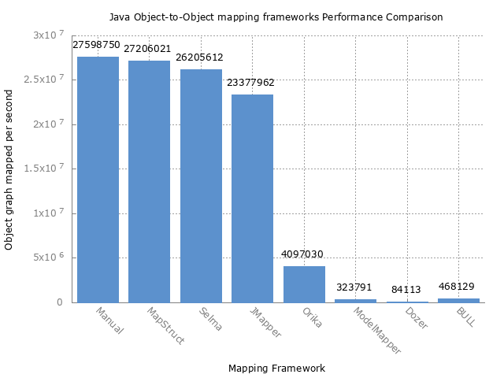

# Object-to-object mapping framework microbenchmark

Multi-layered applications often require to map between different object models (e.g. DTOs and entities). 
Writing such boiler plate mapping code is a tedious and error-prone task.
A lot of object-to-object mapping Java frameworks aims to simplify this work and automate it.
Some uses code instrospection (eg. Dozer). Other uses code generation (ex: MapStruct).
This micro-benchmark compares performance of 8 frameworks. Results could be compared to the benchmark of a code written manually. 

Benchmark are powered by a tool called [JMH](http://openjdk.java.net/projects/code-tools/jmh/) or also known as "Java Microbenchmarking Harness".
JMH is developed by the OpenJDK team. 

## Benchmarked object to object mapper frameworks

- [Dozer](https://github.com/DozerMapper/dozer)
- [MapStruct](http://mapstruct.org/)
- [ModelMapper](http://modelmapper.org/)
- [Selma](http://www.selma-java.org/)
- [Orika](https://github.com/orika-mapper/orika)
- [JMapper](https://github.com/jmapper-framework/jmapper-core)
- [BULL](https://github.com/HotelsDotCom/bull)
- [datus](https://github.com/roookeee/datus)
- [ReMap](https://github.com/remondis-it/remap)

## Contributing to benchmark

Github is for social coding platform: if you want to add another mapping framework or optimize an existing one, we encourage contributions 
through pull requests from [forks of this repository](http://help.github.com/forking/).
If you want to contribute code this way, please reference a GitHub ticket as well covering the specific issue you are addressing.
To add a new mapper, please add a unit test that extends the `AbstractMapperTest` class and declare your mapper into the `MapperBenchmark` class. 

## Data model

The data model used by this benchmark is very basic. It comes from the [Comparison](https://github.com/jhalterman/modelmapper/blob/master/core/src/test/java/org/modelmapper/performance/Comparison.java) class from the ModelMapper framework.
It includes combinations which usually appear in Java Beans, such as:

* Object types
* Collections

## Launch the benchmark

_Pre-requisites: Maven 3.x and a JDK 8 (or above)_

``git clone git://github.com/arey/java-object-mapper-benchmark.git``

``mvn clean install``

``java -jar target/benchmarks.jar``

Optional: To run a single benchmark, such as MapStruct, use `java -jar target/benchmarks.jar -p type=MapStruct`

## Interpreting the Results

The benchmarks measure throughput, given in "ops/time". The time unit used is seconds.
Generally, the score represents the number of graph object mapped per second; the higher the score, the better.

## Results

Tests has been performed on:

* OS: macOS High Sierra
* CPU: 3.1 GHz Intel Core i7, 2 cores, L2 Cache (per Core): 256 KB,  L3 Cache: 4 MB
* RAM: 16 GB 1867 MHz DDR3
* JVM: Oracle 1.8.0_74-b02 64 bits

| Benchmark      | Mode  | Samples | Score       | Margin error (+/-) | Units |
|----------------|-------|---------|-------------|--------------------|-------|
| Manual         | thrpt | 200     | 26 978 437  | 615 002            | ops/s |
| MapStruct      | thrpt | 200     | 28 039 597  | 199 255            | ops/s |
| Selma          | thrpt | 200     | 27 518 789  | 238 602            | ops/s |
| JMapper        | thrpt | 200     | 24 531 754  | 123 945            | ops/s |
| Orika          | thrpt | 200     |  4 565 378  |  24 947            | ops/s |
| ModelMapper    | thrpt | 200     |    184 304  |  12 777            | ops/s |
| Dozer          | thrpt | 200     |     89 860  |     462            | ops/s |
| BULL           | thrpt | 200     |    178 027  |     679            | ops/s |
| datus          | thrpt | 200     |  8 230 775  |  59 673            | ops/s |

## Documentation

* [Micro-benchmark of Java mapping object frameworks](http://javaetmoi.com/2015/09/benchmark-frameworks-java-mapping-objet/) (french article)

## Generating plot

1. Run benchmark while exporting results to csv with `java -jar target/benchmarks.jar -rff results.csv -rf csv`
2. Use gnuplot to generate plot with `gnuplot benchmark.plt`. This will output `results.png`.

## Credits

* Uses [Maven](http://maven.apache.org/) as a build tool
* Uses [JMH](http://openjdk.java.net/projects/code-tools/jmh/) for Java Microbenchmarking Harness
